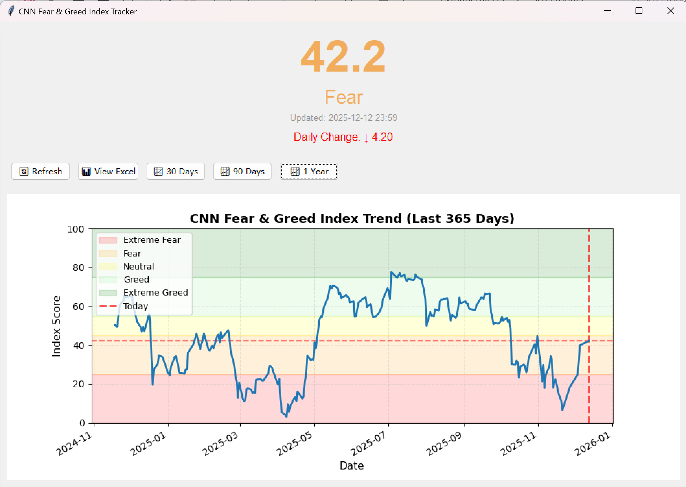
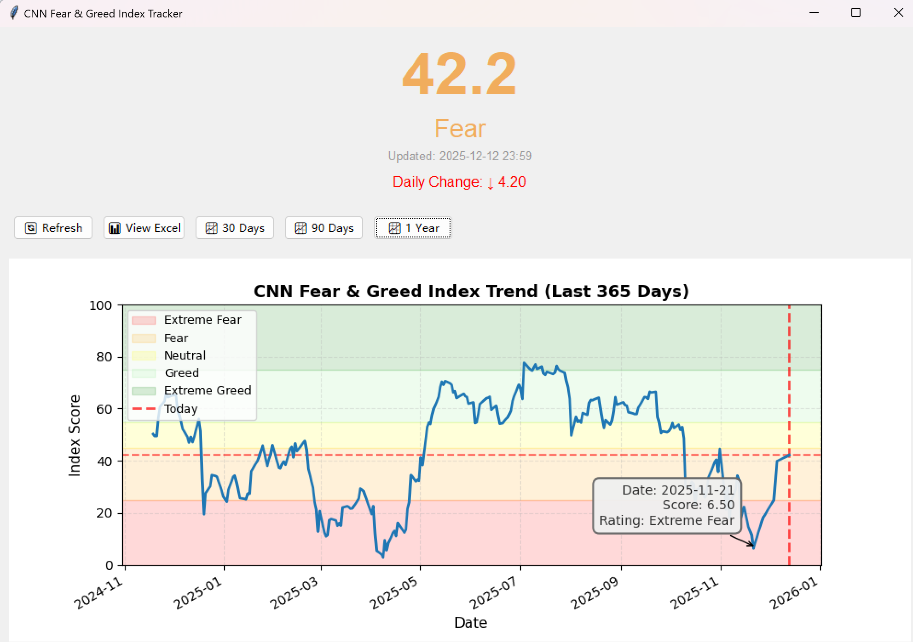

# CNN Fear & Greed Index Tracker

A desktop application for tracking and visualizing CNN's Fear & Greed Index with interactive charts and historical data analysis.


## 📊 Overview

The CNN Fear & Greed Index measures market sentiment on a scale from 0 (Extreme Fear) to 100 (Extreme Greed). This tool automates the daily routine of checking the index by providing:

- **Real-time data fetching** from CNN's API
- **Interactive visualizations** with hover tooltips
- **Historical trend analysis** across multiple timeframes
- **Automatic data persistence** to Excel for record-keeping

## ✨ Features

### Core Functionality
- 🔄 **Auto-refresh on startup** - Latest data loads automatically
- 📈 **Multiple timeframes** - View 30-day, 90-day, or 1-year trends
- 🖱️ **Interactive tooltips** - Hover over data points for details
- 💾 **Excel export** - All data saved with summary statistics
- 🎨 **Color-coded ratings** - Visual indicators for market sentiment
- 📍 **Today's marker** - Red dashed lines highlight current position

### Technical Highlights
- Handles API rate limiting with custom headers
- Timezone-aware datetime handling
- Threaded data fetching to prevent UI freezing
- Adaptive chart rendering (markers for short-term, clean lines for long-term)
- Interactive data exploration with mplcursors

## 🖥️ Screenshots

### Main Interface

*Real-time Fear & Greed Index with daily change indicator*

### Interactive Chart

*Historical trend visualization with color-coded sentiment zones*

### Hover Tooltip

*Interactive tooltips showing exact values on hover*

## 🚀 Installation

### Prerequisites
- Python 3.7 or higher
- pip package manager

### Quick Start

1. **Clone the repository**
   ```bash
   git clone https://github.com/Alina0825/fear-greed-tracker.git
   cd fear-greed-tracker
   ```

2. **Install dependencies**
   ```bash
   pip install -r requirements.txt
   ```

3. **Run the application**
   ```bash
   python cnn_fear_greed.py
   ```

## 📖 Usage

### Basic Operation
1. Launch the application
2. Wait for automatic data refresh (3-5 seconds on first run)
3. View current index and rating in large display
4. Click timeframe buttons to adjust chart view
5. Hover over data points to see exact values

### Button Functions

| Button | Function |
|--------|----------|
| 🔄 Refresh | Fetch latest data from CNN API |
| 📊 View Excel | Open saved data file |
| 📈 30 Days | Show short-term trend |
| 📈 90 Days | Show medium-term trend |
| 📈 1 Year | Show long-term trend (clean line view) |

### Understanding the Index

| Score Range | Rating | Market Sentiment |
|-------------|--------|------------------|
| 0 - 25 | Extreme Fear | Potential buying opportunity |
| 25 - 45 | Fear | Caution advised |
| 45 - 55 | Neutral | Balanced sentiment |
| 55 - 75 | Greed | Market optimism |
| 75 - 100 | Extreme Greed | Potential market top |

## 🎯 Use Cases

### For Investors
- **Contrarian Strategy**: Buy during extreme fear, sell during extreme greed
- **Risk Management**: Use as a supplementary indicator for portfolio decisions
- **Historical Context**: Compare current sentiment with past market conditions

### For Analysts
- **Trend Analysis**: Track sentiment changes over different timeframes
- **Report Generation**: Export data to Excel for presentations
- **Correlation Studies**: Compare with market indices and other indicators

## 🏗️ Technical Architecture

### Data Flow
```
User Launch → Auto Fetch Historical Data → Display UI
     ↓
Manual Refresh → API Request → Data Processing → Update Display & Excel
     ↓
Chart Interaction → Hover Event → Tooltip Display
```

### Key Components
- **FearGreedTracker**: Main application class managing UI and data
- **API Handler**: Manages HTTP requests with retry logic and error handling
- **Data Manager**: Handles DataFrame operations and Excel I/O
- **Chart Manager**: Adaptive rendering based on timeframe selection

### Design Decisions
- **Threading**: Prevents UI freezing during network requests
- **Adaptive Markers**: Removes data points for long-term views to reduce visual clutter
- **Hover Mode 2**: Tooltips disappear when mouse leaves for cleaner interaction
- **Excel Storage**: Universal format for easy data sharing and analysis

## 🛠️ Configuration

### API Settings
The application uses CNN's public Fear & Greed Index API:
```
https://production.dataviz.cnn.io/index/fearandgreed/graphdata
```

Custom headers bypass rate limiting:
```python
headers = {
    'User-Agent': 'Mozilla/5.0...',
    'Accept': 'application/json',
    'Referer': 'https://edition.cnn.com/'
}
```

### File Locations
- **Data file**: `fear_greed_index.xlsx` (auto-created in project directory)
- **Contains**: Historical data and summary statistics

## 🐛 Troubleshooting

### Common Issues

**Problem**: "418 Client Error"
- **Solution**: Code includes proper headers; if issue persists, wait a few seconds and retry

**Problem**: Data not loading on first run
- **Solution**: Application fetches 1 year of historical data initially (may take 10-15 seconds)

**Problem**: Chart looks cluttered
- **Solution**: Use "1 Year" view for clean line visualization without markers

**Problem**: Excel file locked
- **Solution**: Close Excel before refreshing data in application

## 🛣️ Roadmap

Future enhancements:
- [ ] Push notifications for extreme readings (< 20 or > 80)
- [ ] Integration with portfolio tracking
- [ ] Correlation analysis with major indices (S&P 500, VIX)
- [ ] Email alerts for significant sentiment changes
- [ ] Mobile responsive version

## 📚 Project Background

### Motivation
This project was created to automate the daily task of checking market sentiment. Manually visiting CNN's website every day was time-consuming and didn't provide easy access to historical trends or comparative analysis.

### Learning Outcomes
- API integration and handling anti-bot measures
- Building responsive GUI applications with Tkinter
- Data visualization best practices
- Asynchronous programming in Python
- User experience design for data-heavy applications

## 🤝 Contributing

Contributions are welcome! Please feel free to:
- Report bugs or issues
- Suggest new features
- Submit pull requests
- Improve documentation

## 📄 License

This project is licensed under the MIT License - see the [LICENSE](LICENSE) file for details.

## 👤 Author

**Alina**
- GitHub: [@Alina0825](https://github.com/Alina0825)
- Project: Transitioning to Tech/Finance

## 🙏 Acknowledgments

- CNN for providing the Fear & Greed Index API
- The Python community for excellent libraries
- Contributors to open-source data visualization tools

## 📞 Contact

For questions, suggestions, or collaboration opportunities:
- Open an issue on GitHub

---

**Disclaimer**: This tool is for educational and informational purposes only. Always conduct your own research and consult with financial advisors before making investment decisions.

## ⭐ Star History

If you find this project useful, please consider giving it a star! It helps others discover the tool and motivates continued development.
